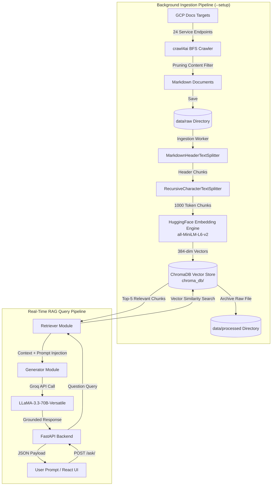

# Lumina — Enterprise GCP RAG Engine & AI Assistant

<div align="center">


<br />

> **Lumina** is a production-grade, full-stack **Retrieval-Augmented Generation (RAG)** platform designed to answer complex technical questions across 24 official Google Cloud Platform (GCP) AI & ML documentation domains. Built with autonomous web scraping, dual-stage hierarchical chunking, zero-cost local vector embeddings, and Groq-accelerated LPU inference.

[Key Features](#-key-features) • [Architecture](#-system-architecture) • [Deep Dive](#-technical-deep-dive) • [Tech Stack & Trade-offs](#-tech-stack--engineering-trade-offs) • [Getting Started](#-getting-started) • [API Reference](#-api-reference)

---

</div>

## 💡 Engineering Highlights

- **⚡ Sub-Second LPU Inference**: Leverages Groq hardware acceleration with `llama-3.3-70b-versatile` for near-instant response times.
- **🕸️ Autonomous BFS Deep Crawler**: Powered by `crawl4ai` with dynamic filtering, depth-limited search (BFS), and automated markdown content pruning.
- **🎯 2-Stage Hierarchical Chunking**: Preserves structural markdown headers (`#`, `##`, `###`) before applying token-bounded recursive character splitting.
- **💰 100% Zero-Cost Embeddings**: Local high-density vector representation using HuggingFace `all-MiniLM-L6-v2` (384-dim dense vectors).
- **🔒 Guardrailed Hallucination Prevention**: Strict domain enforcement prompts prohibiting out-of-scope answers and mandating explicit fallback state when evidence is absent.
- **🎨 Cyberpunk / Anime UI UX**: Distinctive dark-mode frontend constructed with React 19, CSS design tokens, pre-loaded prompt chips, and real-time interaction feedback.

---

## 🏗️ System Architecture

Lumina separates **Data Ingestion** from **Real-Time Inference**, ensuring zero performance degradation on vector search operations when harvesting new documentation.



---

## 🔬 Technical Deep Dive

### 1. Dynamic Web Harvesting & Crawling Engine
- **Implementation**: [`scraping/scraping.py`](file:///e:/Projects/RAG%20PROJECT/Lumina/scraping/scraping.py)
- **Crawler Framework**: `crawl4ai` with `AsyncWebCrawler`.
- **Search Strategy**: `BFSDeepCrawlStrategy` configured with `max_depth=2` and `max_pages=50` to harvest documentation subpages recursively without venturing off-domain.
- **Filtering Pipeline**:
  - `URLPatternFilter`: Restricts crawling strictly to official GCP subdomains (`https://docs.cloud.google.com/<product>/*`).
  - `PruningContentFilter(threshold=0.5)`: Strips boilerplate headers, footers, navigation bars, and uninformative inline elements prior to local saving.
  - Tag Exclusion: Drops non-semantic markup elements (`li`, `ul`, `picture`).

### 2. Local Storage Management & Lifecycle
- **Implementation**: [`storage/local_storage.py`](file:///e:/Projects/RAG%20PROJECT/Lumina/storage/local_storage.py)
- **Design Pattern**: File-system object repository enforcing clean lifecycle isolation between raw un-indexed documents and indexed data.
- **Workflow**:
  - Crawled markdown files write to `data/raw/`.
  - Once indexed into ChromaDB, documents are cleanly migrated to `data/processed/` using atomic file system transfers (`shutil.copy2` + unlinking).

### 3. Dual-Stage Hierarchical Document Chunking Strategy
- **Implementation**: [`rag/chunking.py`](file:///e:/Projects/RAG%20PROJECT/Lumina/rag/chunking.py)
- **Problem**: Standard fixed-size chunking breaks mid-sentence or mid-code block, severing semantic context.
- **Solution**:
  - **Stage 1 (`MarkdownHeaderTextSplitter`)**: Splits raw markdown strictly by structural header tags (`#`, `##`, `###`). Section titles are preserved as contextual metadata attached to each document chunk.
  - **Stage 2 (`RecursiveCharacterTextSplitter`)**: Any header section exceeding `CHUNK_SIZE=1000` characters is recursively broken down with a `CHUNK_OVERLAP=200` overlap window to maintain embedding continuity across split boundaries.

### 4. Vector Embedding & Storage Infrastructure
- **Implementation**: [`rag/embedding.py`](file:///e:/Projects/RAG%20PROJECT/Lumina/rag/embedding.py), [`rag/indexer.py`](file:///e:/Projects/RAG%20PROJECT/Lumina/rag/indexer.py)
- **Embedding Model**: `sentence-transformers/all-MiniLM-L6-v2` via `langchain-huggingface`. Converts text into 384-dimensional dense vectors locally.
- **Vector Database**: `ChromaDB` (`langchain-chroma`) persisted locally under `chroma_db/` in the collection `embedded_files`.
- **Key Advantage**: Zero external API network overhead, zero embedding costs, zero rate limits, and full data privacy.

### 5. Semantic Vector Retrieval
- **Implementation**: [`rag/retriever.py`](file:///e:/Projects/RAG%20PROJECT/Lumina/rag/retriever.py)
- Performs cosine similarity query matching inside ChromaDB vector space.
- Fetches `top_k=5` highest similarity document chunks per incoming user query to assemble optimal context window payloads.

### 6. LLM Orchestration & Prompt Guardrails
- **Implementation**: [`rag/generator.py`](file:///e:/Projects/RAG%20PROJECT/Lumina/rag/generator.py)
- **Model Engine**: Groq-hosted `llama-3.3-70b-versatile` operating at low temperature (`0.2`) to minimize hallucination variance.
- **Prompt Engineering**: System instructions restrict answer generation exclusively to the injected GCP context chunks. Out-of-domain queries or requests lacking relevant retrieved documents trigger explicit fallback responses directing users to verify their question parameters.

### 7. Cyberpunk React Frontend UX
- **Implementation**: [`frontend/src/App.jsx`](file:///e:/Projects/RAG%20PROJECT/Lumina/frontend/src/App.jsx)
- Custom dark-theme interface utilizing anime/manga cyberpunk aesthetic elements, status badges, typography styling (`Bebas Neue`, `Share Tech Mono`), pre-built query history chips, auto-scrolling message streams, and active server state indicators.

---

## 🌐 24 Ingested GCP Documentation Domains

Lumina continuously crawls and indexes 24 specialized GCP product suites configured in [`config/config.py`](file:///e:/Projects/RAG%20PROJECT/Lumina/config/config.py):

| Product | Category | Subcategory | Target Endpoint |
|---|---|---|---|
| **Vertex AI** | AI/ML | ML Platform | `vertex-ai/docs` |
| **Vertex AI Generative AI** | AI/ML | Generative AI | `vertex-ai/generative-ai/docs` |
| **Gemini API** | AI/ML | Generative AI | `gemini-api/docs` |
| **Dialogflow CX** | AI/ML | Conversational AI | `dialogflow/docs` |
| **Dialogflow ES** | AI/ML | Conversational AI | `dialogflow/es/docs` |
| **Agent Builder** | AI/ML | Conversational AI | `agent-builder/docs` |
| **Agent Assist** | AI/ML | Conversational AI | `agent-assist/docs` |
| **Contact Center AI** | AI/ML | Conversational AI | `contact-center/docs` |
| **Cloud Vision API** | AI/ML | Vision | `vision/docs` |
| **Video Intelligence API** | AI/ML | Vision | `video-intelligence/docs` |
| **AutoML Vision** | AI/ML | Vision | `vertex-ai/docs/image-data` |
| **Vertex AI Vision** | AI/ML | Vision | `vertex-ai-vision/docs` |
| **Natural Language API** | AI/ML | Natural Language | `natural-language/docs` |
| **Cloud Translation** | AI/ML | Natural Language | `translate/docs` |
| **Healthcare NLP AI** | AI/ML | Natural Language | `healthcare-api/docs` |
| **Speech-to-Text** | AI/ML | Speech | `speech-to-text/docs` |
| **Text-to-Speech** | AI/ML | Speech | `text-to-speech/docs` |
| **Document AI** | AI/ML | Document AI | `document-ai/docs` |
| **Cloud TPU** | AI/ML | ML Infrastructure | `tpu/docs` |
| **Deep Learning Containers**| AI/ML | ML Infrastructure | `deep-learning-containers/docs` |
| **Deep Learning VM** | AI/ML | ML Infrastructure | `deep-learning-vm/docs` |
| **Timeseries Insights API** | AI/ML | Data for ML | `timeseries-insights/docs` |
| **Recommendations AI** | AI/ML | Data for ML | `recommendations-ai/docs` |
| **Vertex AI Search Retail** | AI/ML | Data for ML | `retail/docs` |

---

## 📁 Repository Structure

```
Lumina/
├── api/
│   └── main.py              # FastAPI server exposing POST /ask/ endpoint
├── config/
│   └── config.py            # Global environment & GCP endpoints config
├── data/
│   ├── raw/                 # Incoming scraped markdown files (pre-indexing)
│   └── processed/           # Archive directory for successfully indexed files
├── chroma_db/               # Persistent ChromaDB vector database index files
├── frontend/                # Cyberpunk React 19 + Vite frontend application
│   ├── src/
│   │   ├── App.jsx          # Cyberpunk chat UI component & state logic
│   │   ├── App.css          # Custom styling definitions
│   │   └── main.jsx         # React application entry point
│   ├── package.json         # React frontend dependencies & scripts
│   └── vite.config.js       # Vite bundler configuration
├── rag/
│   ├── chunking.py          # 2-Stage MarkdownHeaderText & Character Chunker
│   ├── embedding.py         # HuggingFace MiniLM-L6-v2 local embedding wrapper
│   ├── generator.py         # Groq LLaMA 3.3 70B prompt generator & guardrails
│   ├── indexer.py           # ChromaDB document store indexing manager
│   ├── ingestion.py         # Storage-to-VectorDB ingestion pipeline driver
│   ├── pipeline.py          # Unified RAG Pipeline orchestrator
│   └── retriever.py         # Vector similarity search retriever module
├── scraping/
│   └── scraping.py          # crawl4ai BFS deep web crawler for GCP docs
├── .env.exemple             # Template for required environment variables
├── main.py                  # CLI entry point (Dual mode: --setup or chat CLI)
└── requirements.txt         # Backend Python dependencies
```

---

## ⚖️ Tech Stack & Engineering Trade-offs

| Domain | Technology Chosen | Alternatives Evaluated | Engineering Rationale & Trade-offs |
|---|---|---|---|
| **Web Crawling** | `crawl4ai` | BeautifulSoup, Scrapy, Selenium | Async Playwright execution natively converts HTML to semantic markdown while supporting BFS deep crawl filters. Removes HTML clutter before ingestion. |
| **Vector Embeddings** | `all-MiniLM-L6-v2` | OpenAI `text-embedding-3-small` | 100% free, runs locally on CPU with zero network latency or API rate limits. 384-dimensional vector size provides lightweight memory footprint with sharp similarity scoring. |
| **Vector Database** | `ChromaDB` | Pinecone, Qdrant, Milvus | Serverless and locally persistent. Eliminates cloud database maintenance and Docker setup overhead for local development while offering fast in-memory indexing. |
| **LLM Inference** | `Groq (LLaMA-3.3-70B)` | OpenAI GPT-4o, Anthropic Claude | Sub-second token output speeds via Groq LPU hardware at zero cost on developer tier. 70B parameters deliver high accuracy for technical GCP queries. |
| **Chunking Strategy**| 2-Stage Header Split | Fixed Character Chunking | Header splitting preserves section titles as document metadata. Prevents context fragmentation across technical code snippets and header topics. |
| **API Framework** | `FastAPI` | Flask, Django | Asynchronous request handling, built-in OpenAPI documentation, Pydantic type safety validation, and high throughput under concurrent queries. |

---

## 🚀 Getting Started

### Prerequisites
- **Python**: `3.11` or higher
- **Node.js**: `v18` or higher
- **Groq API Key**: Obtain a free API key from [Groq Console](https://console.groq.com)

### 1. Repository Setup & Environment
```bash
# Clone repository
git clone https://github.com/your-username/lumina.git
cd lumina

# Copy environment variables template
cp .env.exemple .env
```
Edit `.env` and set your `GROQ_API_KEY`:
```env
GROQ_API_KEY=gsk_your_actual_groq_api_key_here
```

### 2. Install Backend Dependencies
```bash
# Create and activate virtual environment (optional but recommended)
python -m venv venv
# On Windows:
venv\Scripts\activate
# On Linux/macOS:
source venv/bin/activate

# Install Python requirements
pip install -r requirements.txt

# Install Playwright browser binaries for crawl4ai
python -m playwright install
```

### 3. Run One-Time Background Ingestion Pipeline
To scrape GCP documentation, chunk documents, compute embeddings, and build the local vector database index:
```bash
python main.py --setup
```
> *Note: This will populate `data/raw/`, `data/processed/`, and build the vector index inside `chroma_db/`.*

---

## 🎮 Running the Application

### Option A: Full-Stack Web App (Recommended)

Run the backend and frontend in separate terminal windows:

**Terminal 1 — FastAPI Backend Server**
```bash
python -m uvicorn api.main:app --host 0.0.0.0 --port 8000 --reload
```

**Terminal 2 — React Cyberpunk Frontend**
```bash
cd frontend
npm install
npm run dev
```
Open your browser at `http://localhost:5173`.

---

### Option B: Interactive CLI Mode

Query the RAG pipeline directly from your command line without starting servers:
```bash
python main.py
```
```text
Ask a question (or 'exit' to quit): What is the difference between Dialogflow CX and ES?

[Lumina Response]:
Dialogflow CX (Customer Experience) is designed for enterprise-level, complex, multi-turn conversational agents with state machine architectures...
```

---

## 📡 API Reference

### `POST /ask/`
Submits a user query to the RAG pipeline and returns a grounded response.

#### Request Header
`Content-Type: application/json`

#### Request Body Schema
```json
{
  "question": "How does Vertex AI handle model versioning?"
}
```

#### Response Payload Schema
```json
{
  "answer": "Vertex AI Model Registry provides centralized tracking for machine learning model versions. When you register a new model or train a new version using Vertex AI Pipelines..."
}
```

#### Example cURL Command
```bash
curl -X POST "http://localhost:8000/ask/" \
  -H "Content-Type: application/json" \
  -d '{"question": "How does Vertex AI handle model versioning?"}'
```

---

## 🗺️ Engineering Roadmap

- [ ] **Hybrid Search Integration**: Combine dense vector retrieval with BM25 sparse keyword search for improved exact-match precision on GCP API signatures.
- [ ] **Contextual Re-Ranking**: Integrate Cohere or BGE Reranker to re-order top-K candidate chunks before passing them to the generator.
- [ ] **Automated RAG Evaluation**: Implement RAGAS framework metrics (Context Recall, Context Precision, Faithfulness, Answer Relevance).
- [ ] **Observability & Tracing**: Integrate LangSmith or Phoenix for real-time tracing of document retrieval and latency bottlenecks.

---

<div align="center">

Crafted with ❤️ for high-performance AI Engineering.

</div>
